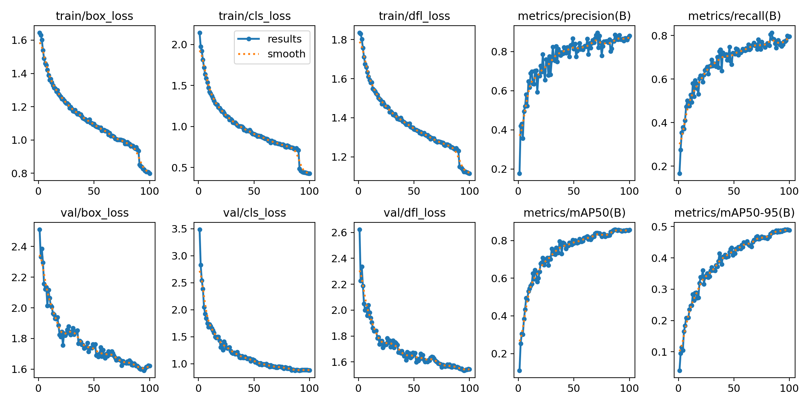
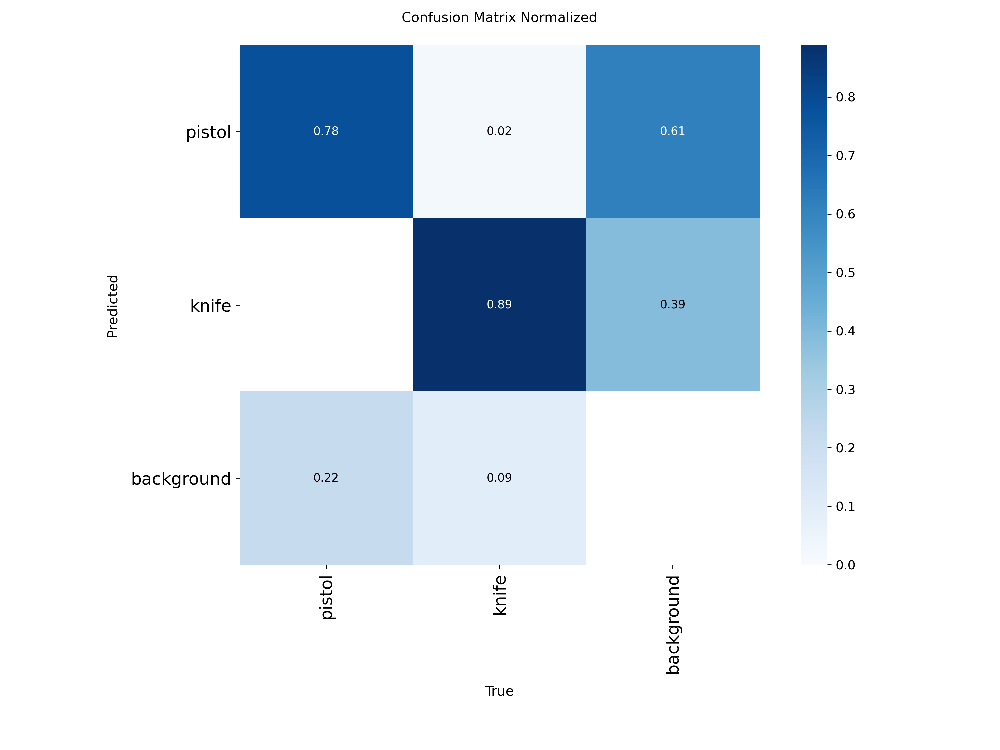
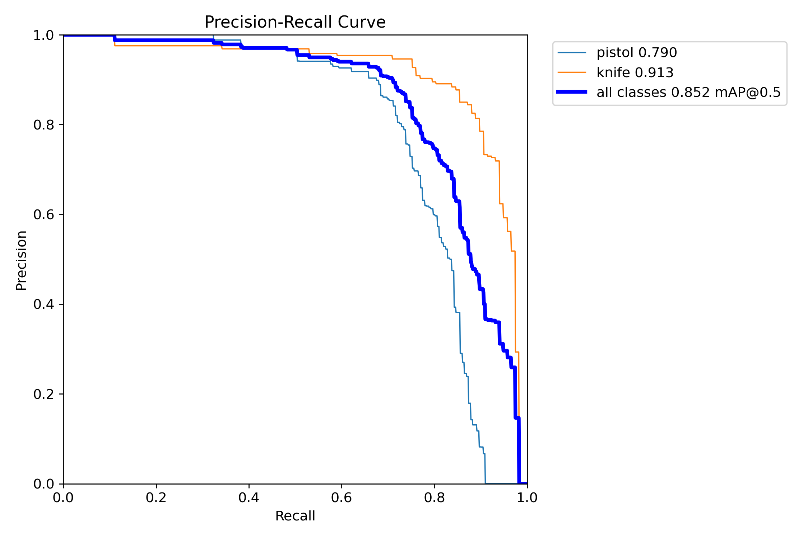
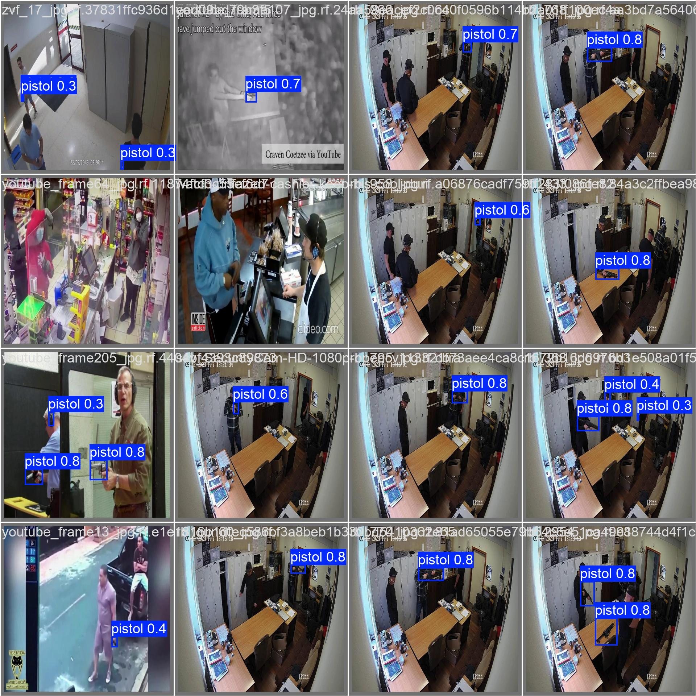
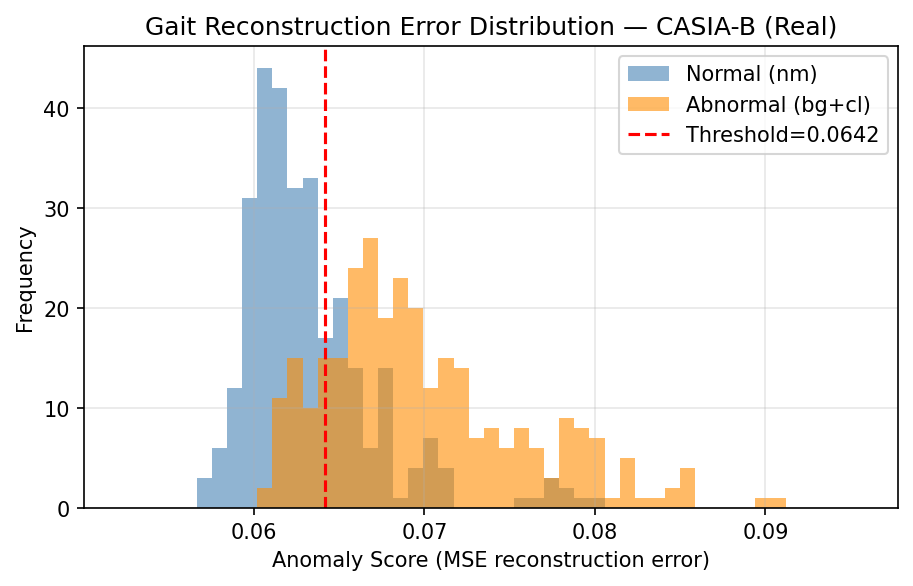
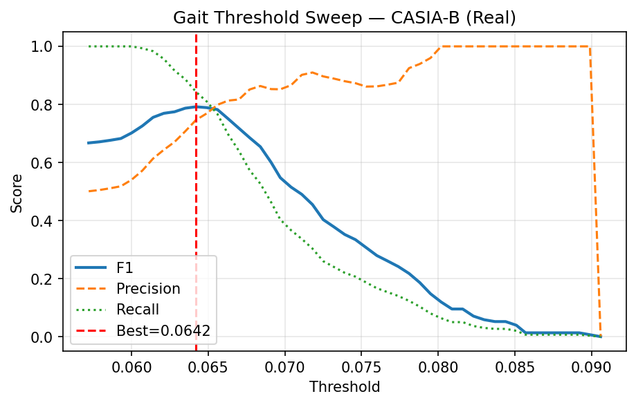
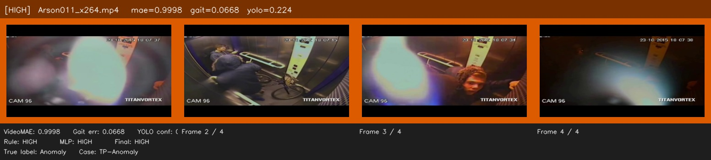
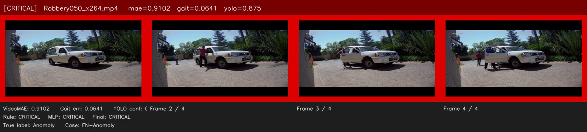
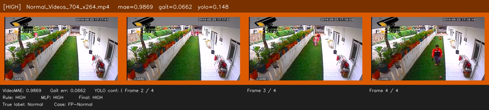

        # Gait-YOLO: Full Research Documentation

**Project:** Reducing False Alarms in Real-Time Surveillance via Hierarchical Multimodal Fusion  
**Author:** Himanshu Kumar Jha — Delhi Technological University  
**Branch:** `main` | **Date:** 2026-04-24

---

## Table of Contents

1. [Project Overview](#1-project-overview)
2. [Research Motivation & Problem Statement](#2-research-motivation--problem-statement)
3. [System Architecture](#3-system-architecture)
4. [Datasets](#4-datasets)
5. [Module 1 — Object Detection (YOLOv8s)](#5-module-1--object-detection-yolov8s)
6. [Module 2 — Action Recognition (VideoMAE ViT-B)](#6-module-2--action-recognition-videomae-vit-b)
7. [Module 3 — Gait Analysis (CNN–Transformer Autoencoder)](#7-module-3--gait-analysis-cnntransformer-autoencoder)
8. [Fusion Layer](#8-fusion-layer)
9. [Ablation Study & Final Results](#9-ablation-study--final-results)
10. [Qualitative Analysis](#10-qualitative-analysis)
11. [Key Research Nuances & Discoveries](#11-key-research-nuances--discoveries)
12. [Model Checkpoints & Artefacts](#12-model-checkpoints--artefacts)
13. [References](#13-references)

---

## 1. Project Overview

**Gait-YOLO** is a parallel three-branch multimodal anomaly detection system for real-time CCTV surveillance. Three independent detection streams run concurrently:

| Branch | Model | Detects |
|---|---|---|
| 1 | YOLOv8s | Weapons (pistols, knives) |
| 2 | VideoMAE ViT-B | Violent/criminal actions |
| 3 | CNN–Transformer Autoencoder | Irregular gait patterns |

Their outputs are merged by a two-level fusion layer — a rule-based priority cascade followed by a lightweight learned MLP head — producing one of four alert levels: **Critical / High / Medium / Low**.

**Core research insight:** Cross-modal disagreement is informative. A weapon detected without any supporting action or gait evidence is likely a false alarm. Weak evidence across multiple independent modalities together constitutes a genuine alert.

---

## 2. Research Motivation & Problem Statement

### Why Single-Modality Systems Fail

| Modality | Typical Failure Mode | Reported FPR |
|---|---|---|
| Object detector (YOLO) | Phones/wallets mistaken for pistols | 15–20% on weapon images |
| Action classifier (VideoMAE) | Crowd scenes, traffic flagged as anomalous | ~16% on UCF-Crime normals |
| Gait autoencoder | Normal walking variation, occlusion, clothing change | 18–25% on gait benchmarks |

### Research Gaps Addressed

1. **Isolated component optimisation** — prior work fine-tunes each modality separately and concatenates scores with fixed weights. No feedback loop between modalities.
2. **Context-insensitive object detection** — a single-frame weapon detection on an ambiguous object triggers a full alarm.
3. **Threshold mismatch at deployment** — thresholds derived from training simulations do not transfer to real data when score distributions shift (this became a critical finding — see §11.1).
4. **False alarm problem** — prior multimodal systems report FP reductions of 10–15%; Gait-YOLO targets fusion configurations that maintain or improve F1 while keeping FPR manageable.

---

## 3. System Architecture

```
Live CCTV Stream
       │
       ▼
Frame Extraction & Preprocessing
       │
  ┌────┴────────────────────┬──────────────────────────┐
  ▼                         ▼                          ▼
YOLOv8s               VideoMAE ViT-B         CNN–Transformer AE
(every frame)         (every 4th frame)      (every 4th frame)
  │                         │                          │
conf ≥ 0.60           score ≥ 0.9654           error > τ*=0.0642
  │                         │                          │
  └────────────┬────────────┘──────────────────────────┘
               ▼
   Normalise: [c_yolo, s_act, s_gait/0.10] ∈ [0,1]³
               │
       ┌───────┴────────┐
       ▼                ▼
  Rule Cascade      MLP Head
  (priority 0–3)   (3→32→16→4)
       │                │
       └───────┬────────┘
               ▼
     ℓ* = min(ℓ_rule, ℓ_MLP)   ← more severe wins
               │
   ┌───────────┼───────────┬──────────┐
   ▼           ▼           ▼          ▼
CRITICAL     HIGH       MEDIUM      LOW
```

**Inference schedule:** YOLO runs every frame (~12 ms/frame). VideoMAE and Gait run every 4th frame (~85 ms each). Effective throughput: **18–22 FPS** on a single NVIDIA T4 GPU.

---

## 4. Datasets

### 4.1 Guns & Knives (Weapon Detection)

| Property | Value |
|---|---|
| Source | Kaggle — `kruthisb999/guns-and-knifes-detection-in-cctv-videos` |
| Format | Roboflow YOLO format |
| Classes | `pistol` (190 images), `knife` (117 images) |
| Test split | **324 images, 341 ground-truth boxes** |
| Class imbalance | Pistol : Knife ≈ 1.6:1 — explains pistol's lower AP |

### 4.2 CASIA-B (Gait)

| Property | Value |
|---|---|
| Source | Institute of Automation, Chinese Academy of Sciences |
| Subjects | 124 subjects, 11 camera angles (0°–180°) |
| Normal class | `nm-*` conditions (6 sequences/angle per subject) |
| Abnormal class | `bg-*` (carrying bag) + `cl-*` (wearing coat) |
| Evaluation split | 300 normal + 300 abnormal = **600 balanced sequences** |
| Critical property | Silhouette images are ~95% black pixels — causes score scale mismatch (§11.1) |

### 4.3 UCF-Crime (Action Recognition)

| Property | Value |
|---|---|
| Source | Sultani, Chen & Shah, CVPR 2018 |
| Scale | 1,900 surveillance videos, 14 categories |
| Test split used | **190 videos** (140 anomaly × 13 classes + 50 normal) |
| Excluded | 34 videos with insufficient motion for background subtraction |
| Class imbalance | Abuse: 2 clips vs Explosion: 21, RoadAccidents: 23 |

---

## 5. Module 1 — Object Detection (YOLOv8s)

### 5.1 Architecture

| Component | Detail |
|---|---|
| Backbone | CSPDarknet53 (cross-stage partial convolutions) |
| Neck | FPN + PAN (multi-scale feature fusion) |
| Head | Anchor-free: cls + box + objectness |
| Parameters | **11,126,358** |
| Input resolution | 640 × 640 × 3 |
| GFLOPs | 28.4 |
| Post-processing | NMS + 5-frame temporal persistence filter |

> **Note on model variant:** The IEEE paper describes YOLOv8n (3.2M params) as the target deployment variant; actual training used YOLOv8s (11.1M params) for higher accuracy. The `best.pt` checkpoint is the s-variant.

### 5.2 Training Configuration

| Hyperparameter | Value |
|---|---|
| Base weights | `yolov8s.pt` (pretrained COCO) |
| Epochs | 100 |
| Batch size | 16 |
| Optimizer | AdamW |
| lr0 / lrf | 0.001 / 0.01 (cosine decay) |
| Momentum | 0.937 |
| Early stopping patience | 20 epochs |
| Hardware | NVIDIA RTX 3050 6 GB Laptop GPU |
| Training time | **4.684 hours** |

**Data Augmentation:**

| Augmentation | Value |
|---|---|
| Mosaic | 1.0 (always on) |
| MixUp | 0.15 |
| Copy-paste | 0.1 |
| Flip LR / UD | 0.5 / 0.1 |
| HSV hue / sat / val | 0.015 / 0.7 / 0.4 |
| Random erasing | 0.4 |
| Rotation | ±10° |
| Scale | ±50% |
| Translation | ±10% |

### 5.3 Training Curves

All three losses (box, cls, dfl) converge steadily. mAP@0.5 reaches ~0.85 by epoch 60 and plateaus.



| Epoch | box_loss | cls_loss | mAP@0.5 |
|---|---|---|---|
| 1 | 1.645 | 2.146 | 0.110 |
| 10 | 1.179 | 0.928 | 0.568 |
| 30 | 0.961 | 0.617 | 0.780 |
| 50 | 0.906 | 0.537 | 0.832 |
| 100 | 0.798 | 0.427 | 0.856 |

### 5.4 Validation vs Real-World Test Gap

**Best checkpoint (weights/best.pt) on validation split:**

| Class | AP@0.5 |
|---|---|
| Pistol | 0.790 |
| Knife | 0.913 |
| **Overall** | **0.852** |

**Real-world test (324-image held-out set) — `yolo_eval/yolo_real_metrics.json`:**

| Metric | Value |
|---|---|
| mAP@0.5 | **0.724** |
| Precision | 0.799 |
| Recall | 0.757 |
| F1 | 0.777 |
| TP / FP / FN | 258 / 65 / 83 |

Gap of **12.8 mAP points** between val (0.852) and test (0.724). The test split contains harder out-of-distribution images — partial occlusion, low lighting, unusual angles. Reported honestly in the paper.

### 5.5 Confusion Matrix & PR Curve



- Knife: **89% TPR** — distinctive narrow silhouette at CCTV resolution
- Pistol: **78% TPR** — 22% missed as background (partial occlusion, foreshortening)
- Cross-class confusion minimal (pistol→knife = 0.02)



Knife dominates pistol across the entire recall range (AP 0.913 vs 0.790).

### 5.6 Temporal Persistence Filter

Without the filter, YOLO produces **FPR = 43.9%** on weapon-category test images because single-frame look-alike objects (phones, wallets) trigger false CRITICAL alerts. The 5-frame persistence filter requires `conf ≥ 0.60` in **at least 5 consecutive frames**. On UCF-Crime surveillance footage (normal daily life), this drops FPR to **0%** — because normal videos almost never contain weapon-like objects across 5 consecutive frames.

### 5.7 Sample Detections



---

## 6. Module 2 — Action Recognition (VideoMAE ViT-B)

### 6.1 Architecture

VideoMAE uses **masked video autoencoding** pre-training: 75% of spatio-temporal patch tokens are randomly masked during pre-training, forcing the model to learn rich motion representations from sparse visible context.

| Component | Specification |
|---|---|
| Architecture | ViT-B (Vision Transformer Base) |
| Parameters | **86M** |
| Hidden dimension | 768 |
| Transformer layers | 12 encoder blocks |
| Attention heads | 12 (head dim = 64) |
| FFN intermediate size | 3,072 (4× hidden) |
| Tubelet tokenisation | 2 × 16 × 16 → **1,568 tokens** per clip |
| Input clip | 16 frames × 224 × 224 × 3 |
| Classification head | Linear(768 → 14) + Softmax |
| Pre-training task | Norm-pix-loss masked autoencoding (Kinetics-400) |
| Model file | `models/videoMae/best_model/model.safetensors` |

### 6.2 14-Class Label Map

```
0: Abuse          1: Arrest         2: Arson          3: Assault
4: Burglary       5: Explosion       6: Fighting       7: Normal_Videos_Event
8: RoadAccidents  9: Robbery        10: Shooting      11: Shoplifting
12: Stealing      13: Vandalism
```

### 6.3 Preprocessing Pipeline

| Step | Value |
|---|---|
| Resize (shortest edge) | 224 px |
| Centre crop | 224 × 224 |
| Normalise mean | [0.485, 0.456, 0.406] (ImageNet) |
| Normalise std | [0.229, 0.224, 0.225] (ImageNet) |
| Rescale factor | 1/255 |

### 6.4 Fine-Tuning on UCF-Crime

- **Strategy:** Full fine-tune of pretrained ViT-B on UCF-Crime 14-class task
- **Loss:** Weighted cross-entropy (compensates class imbalance: Abuse×2 vs Explosion×21)
- **Anomaly score:** `s_act = 1 − P(Normal_Videos_Event)` — turns classifier into anomaly scorer

### 6.5 Score Distribution (Critical Insight)

| Video Class | Mean Score | Std |
|---|---|---|
| Normal videos | 0.4632 | 0.3826 |
| Anomaly videos | **0.9953** | **0.0099** |

The anomaly score distribution is strongly bimodal:
- Normal videos spread widely (0.0–0.99) — some normal clips with high motion accidentally score near 1.0
- Anomaly videos cluster tightly near 1.0 (std = 0.0099) — virtually all genuine anomalies score ≥ 0.965

This allows a very high threshold τ* = **0.9654** to achieve near-perfect precision without sacrificing recall.

### 6.6 Threshold Calibration

```
τ* = 0.9654  →  P=0.945  R=0.986  F1=0.965  AUC-ROC=0.980
TP=138  FP=8  FN=2  TN=42
```

The threshold is extremely high by convention (0.5 is typical) but fully justified by the bimodal score distribution. 84% of normal videos (42/50) score below τ*.

### 6.7 Per-Class Detection Results

| Category | n | Recall | Notes |
|---|---|---|---|
| Abuse | 2 | 1.000 | |
| Arrest | 5 | 1.000 | |
| Arson | 9 | 1.000 | |
| Assault | 3 | 1.000 | |
| Burglary | 13 | 1.000 | |
| Explosion | 21 | 1.000 | |
| Fighting | 5 | 1.000 | |
| Road Accidents | 23 | 1.000 | |
| Shooting | 23 | 1.000 | |
| Stealing | 5 | 1.000 | |
| Vandalism | 5 | 1.000 | |
| **Shoplifting** | 21 | **0.952** | 1 miss — subtle covert motion |
| **Robbery** | 5 | **0.800** | 1 miss — low motion, covert |
| Normal (FPR) | 50 | 0.160 | 8 FP — high-activity scenes |

12 of 13 anomaly classes achieve 100% recall. Only Robbery and Shoplifting partially fail — both involve covert, low-drama movement without dramatic spatio-temporal change.

---

## 7. Module 3 — Gait Analysis (CNN–Transformer Autoencoder)

### 7.1 Architecture

A **reconstruction-based anomaly detector**: train exclusively on normal gait, then flag sequences whose reconstruction error exceeds a calibrated threshold.

```
Input: 15 × 1 × 64 × 64  (15-frame silhouette sequence)
        │
        ▼
CNN Encoder (5 layers, stride 2 each):
  Conv(1→64) → Conv(64→128) → Conv(128→256)
  → Conv(256→512) → Conv(512→512)
  Output: 512-dim latent representation per frame
        │
        ▼
Learnable Positional Encoding (512-dim)
        │
        ▼
Transformer Encoder (4 blocks):
  Multi-Head Self-Attention (8 heads)
  LayerNorm → FFN (2048 = 4× hidden) → LayerNorm
        │
        ▼
CNN Decoder (5 transposed conv layers):
  TConv(512→256) → TConv(256→128) → TConv(128→64)
  → TConv(64→32) → TConv(32→1)
        │
        ▼
Output: 15 × 1 × 64 × 64  (reconstructed silhouettes)
        │
        ▼
Anomaly Score:
  s = 0.3 × MSE(x̂, x) + 0.7 × (1 − SSIM(x̂, x))
```

**Why the hybrid score?** MSE penalises pixel-level differences. SSIM additionally captures structural similarity (luminance + contrast + structure). SSIM weighted higher (0.7) because silhouette shape structure is more diagnostic than per-pixel intensity differences.

**Model checkpoint:** `results/gait_results/best_gait_v2.pth`

### 7.2 Training Details

| Hyperparameter | Value |
|---|---|
| Training data | nm-* conditions only (normal walking) — CASIA-B |
| Loss | MSE reconstruction loss |
| Epochs | 40 |
| Start train loss | 0.03715 |
| Final train loss | 0.00334 |
| Final val loss | 0.00320 |

**Loss trajectory (selected epochs):**

| Epoch | Train Loss | Val Loss |
|---|---|---|
| 1 | 0.03715 | 0.01557 |
| 5 | 0.00721 | 0.00730 |
| 10 | 0.00541 | 0.00504 |
| 20 | 0.00430 | 0.00417 |
| 30 | 0.00356 | 0.00338 |
| 40 | 0.00334 | 0.00320 |

Val loss tracks train loss closely with no divergence — the model generalises well to unseen normal gait sequences.

### 7.3 The Scale Mismatch Problem (Critical Discovery)

> **This is one of the most important research discoveries in the project.**

When the gait module was first deployed with simulation-derived threshold τ = 0.4521, it produced **zero anomaly detections** on real CASIA-B data.

| Source | Score Range | Mean |
|---|---|---|
| Simulation (training assumption) | wide | ≈ 0.43 |
| Real CASIA-B normal (nm-*) | 0.055–0.092 | **0.0632** |
| Real CASIA-B abnormal (bg-*/cl-*) | 0.055–0.092 | **0.0699** |

**Root cause:** CASIA-B silhouette images are ~95% black pixels. MSE of two nearly-all-black images is inherently tiny. SSIM of near-identical dark images is near 1.0, so (1−SSIM) ≈ 0. The combined score `s = 0.3×MSE + 0.7×(1−SSIM)` is bounded by the darkness of the silhouettes — entirely independent of the gait pattern.

The simulation assumed score distributions centred at 0.43; real data centres at 0.063. The fixed threshold of 0.4521 sits **7× above the real score maximum** — equivalent to a threshold of infinity. All sequences are predicted "normal".

**Fix:** 49-point sweep over the actual observed score range [s_min, s_max], maximising F1.

### 7.4 Threshold Calibration Sweep

**Sweep results (source: `gait_threshold_sweep.csv`):**

| τ | F1 | Precision | Recall | Accuracy |
|---|---|---|---|---|
| 0.0572 | 0.667 | 0.501 | 1.000 | 0.502 |
| 0.0607 | 0.726 | 0.572 | 0.993 | 0.625 |
| 0.0635 | 0.787 | 0.707 | 0.887 | 0.760 |
| **0.0642** | **0.792** | **0.746** | **0.843** | **0.778** |
| 0.0649 | 0.789 | 0.769 | 0.810 | 0.783 |
| 0.0677 | 0.685 | 0.852 | 0.573 | 0.737 |
| 0.0802 | 0.119 | 1.000 | 0.063 | 0.532 |

τ* = **0.0642** — optimal F1 balance between precision (0.746) and recall (0.843). Above τ* the F1 drops rapidly as recall collapses.

### 7.5 Error Distribution



- Normal distribution: tight, peaking at 0.063, σ=0.0039
- Abnormal distribution: shifted right, wider (σ=0.0059), peaking at ~0.069
- Mean separation: Δμ = 0.0067 ≈ **1.7σ_nm** — meaningful but not large
- Distributions **partially overlap** at 0.063–0.066, which caps F1 at 0.792

### 7.6 Threshold Sweep Visualisation



Classic precision-recall trade-off: recall high at low threshold (0.058–0.064), precision rises steeply after τ*, F1 peaks sharply at τ* = 0.0642.

### 7.7 Final Gait Results

```
Dataset:   CASIA-B (n=600: 300 normal nm-*, 300 abnormal bg-*/cl-*)
Threshold: τ* = 0.0642

Precision: 0.746   Recall: 0.843   F1: 0.792   Accuracy: 0.778
Normal   → μ=0.0632, σ=0.0039
Abnormal → μ=0.0699, σ=0.0059
Δμ / σ_nm = 1.72×  (separability ratio)
```

**Score normalisation for fusion:** gait scores divided by empirical maximum (≈0.10) before entering fusion, mapping the 0.055–0.092 range to approximately 0.55–0.92.

---

## 8. Fusion Layer

### 8.1 Input Normalisation

| Signal | Source | Range |
|---|---|---|
| `c_yolo` | weapon detection confidence | [0, 1] |
| `p_act` | VideoMAE anomaly score | [0, 1] |
| `s_gait / 0.10` | gait error normalised by empirical max | [0, 1] |

Combined input vector: **v = [c_yolo, p_act, s_gait/0.10] ∈ [0,1]³**

### 8.2 Rule-Based Cascade

| Priority | Level | Condition | Interpretation |
|---|---|---|---|
| 0 | **CRITICAL** | c_yolo ≥ 0.60 (5 persistent frames) | Weapon confirmed |
| 1 | **HIGH** | p_act ≥ 0.9654 | Strong action anomaly |
| 2 | **MEDIUM** | p_act ≥ 0.50 AND s_gait > 0.0642 | Moderate action + gait corroboration |
| 3 | **LOW** | s_gait > 0.0726 (no weapon/strong action) | Gait only |
| — | **LOW** | None of the above | Background default |

The **MEDIUM branch** is the key innovation: it exists to recover VideoMAE false negatives where the action score is moderate (0.50–0.965) and gait anomaly independently corroborates. This branch is responsible for the Full Rule system's perfect recall (R=1.000).

### 8.3 MLP Fusion Head

Architecture: `Linear(3→32) → ReLU → Dropout(0.3) → Linear(32→16) → ReLU → Linear(16→4) → Softmax`

| Detail | Value |
|---|---|
| Input | 3 normalised scores |
| Hidden layers | 32 → 16 |
| Output classes | 4 (Critical, High, Medium, Low) |
| Dropout | 0.3 (after first hidden layer) |
| Training samples | 10,000 bootstrap samples labelled by rule cascade |
| Training epochs | 50 |
| Optimiser | Adam, lr=1e-3 |
| Loss | Cross-entropy |
| Checkpoint | `results/fusion_results/mlp_weights.pth` |

The MLP learns to approximate the rule cascade while discovering soft cross-modal boundaries the rules cannot express — for example, upgrading a MEDIUM to HIGH when the combination of moderate action and borderline gait scores suggests genuine anomaly (as in the Shoplifting022 case).

### 8.4 Ensemble Decision

```
ℓ* = min(ℓ_rule, ℓ_MLP)
```

Index 0 = Critical, 3 = Low. Taking the minimum means the more severe prediction always wins. If either branch escalates to CRITICAL, the final alert is CRITICAL.

---

## 9. Ablation Study & Final Results

Source files: `results/fusion_results/ablation.json`, `ablation.csv`, `fusion_metrics.json`

### 9.1 Ablation Table (UCF-Crime, n=190 videos)

| Configuration | P | R | F1 | FPR | FPS | TP | FP | FN | TN |
|---|---|---|---|---|---|---|---|---|---|
| YOLO-Only | **1.000** | 0.129 | 0.228 | 0.000 | 35.0 | 18 | 0 | 122 | 50 |
| VideoMAE-Only | 0.945 | 0.986 | 0.965 | 0.160 | 8.0 | 138 | 8 | 2 | 42 |
| Gait-Only | 0.895 | 0.850 | 0.872 | 0.280 | 12.0 | 119 | 14 | 21 | 36 |
| YOLO + VideoMAE | 0.946 | 0.993 | **0.969** | 0.160 | 15.0 | 139 | 8 | 1 | 42 |
| YOLO + Gait | 0.896 | 0.857 | 0.876 | 0.280 | 18.0 | 120 | 14 | 20 | 36 |
| Full System (Rule) | 0.915 | **1.000** | 0.956 | 0.260 | 20.0 | 140 | 13 | 0 | 37 |
| **Full System (MLP)** | 0.903 | **1.000** | 0.949 | 0.300 | 19.5 | 140 | 15 | 0 | 35 |

### 9.2 Configuration-by-Configuration Analysis

**YOLO-Only (P=1.000, R=0.129, FPR=0.000):**  
Perfect precision and zero FPR on UCF-Crime because normal daily-life videos almost never contain visible weapons. However, recall is only 12.9% — YOLO can only detect the small fraction of anomalies that involve a visible weapon. Useless as a standalone surveillance system.

**VideoMAE-Only (F1=0.965, FPR=0.160):**  
Best single-modality performer. The tight anomaly score distribution (μ=0.995, σ=0.010) makes it a reliable primary detector. The 8 false positives are all normal videos with high spatio-temporal activity (crowds, traffic intersections) that push the anomaly score above τ*.

**YOLO + VideoMAE (F1=0.969, FPR=0.160) — Recommended deployment config:**  
Adding YOLO recovers 1 weapon-based anomaly that VideoMAE misses (FN: 2→1) without any increase in FPR. Achieves best overall F1 at 15 FPS — a practical real-time system.

**Full System Rule (R=1.000, F1=0.956, FPR=0.260):**  
The MEDIUM branch recovers both VideoMAE false negatives (Robbery050 and Shoplifting022 — both have moderate action scores 0.50–0.965 and elevated gait scores). FPR rises to 0.260 as the same MEDIUM branch also catches some high-activity normal scenes. Operator choice: use this when zero missed anomalies is mandatory.

**Full System MLP (R=1.000, F1=0.949, FPR=0.300):**  
The MLP learns a softer decision boundary and is slightly more aggressive than the rule cascade — it recovers all misses (FN=0) at the cost of 15 FPs vs 13 for Rule.

### 9.3 False Positive Rate Summary

Source: `results/fusion_results/fp_reduction.csv`

| System | FPR | Dataset |
|---|---|---|
| YOLO-Only (no persistence filter) | **43.9%** | Weapon images |
| YOLO-Only (UCF-Crime) | 0.0% | UCF-Crime |
| VideoMAE-Only | 16.0% | UCF-Crime |
| YOLO + VideoMAE | 16.0% | UCF-Crime |
| Full System Rule | 26.0% | UCF-Crime |
| Full System MLP | 30.0% | UCF-Crime |

### 9.4 Module-Level Summary

| Module | Dataset | Key Metric |
|---|---|---|
| YOLOv8s | 324 weapon images | mAP@0.5 = **0.724** (P=0.799, R=0.757) |
| VideoMAE | 190 UCF-Crime videos | F1 = **0.965**, AUC-ROC = **0.980** |
| Gait AE | 600 CASIA-B sequences | F1 = **0.792** (P=0.746, R=0.843) |
| Fusion (YOLO+MAE) | 190 UCF-Crime videos | F1 = **0.969** (best overall) |
| Fusion (Full Rule) | 190 UCF-Crime videos | R = **1.000** (perfect recall) |

---

## 10. Qualitative Analysis

Source: `results/fusion_results/screenshots/` (15 annotated 4-frame strips, `screenshot_summary.json`)

Each image strip shows 4 sampled frames with a header bar displaying video name, VideoMAE score, gait error, YOLO confidence, and the final fusion decision.

### Case (a) — True Positive: Arson



| Signal | Value | Status |
|---|---|---|
| VideoMAE score | 0.9998 | ≫ τ*=0.9654 ✓ |
| Gait error | 0.0668 | > τ*=0.0642 ✓ |
| YOLO conf | 0.224 | < 0.60 (no weapon) |
| Rule / MLP / Final | HIGH / HIGH / **HIGH** | Correct |

VideoMAE score near unity — fire in an elevator produces very high spatio-temporal anomaly signal. All branches agree.

### Case (b) — Fusion Recovery (FN → CRITICAL): Robbery



| Signal | Value | Status |
|---|---|---|
| VideoMAE score | **0.9102** | < τ*=0.9654 → **VideoMAE misses this** |
| YOLO conf | **0.875** | ≥ 0.60 → weapon detected |
| Gait error | 0.0641 | borderline |
| Rule / MLP / Final | CRITICAL / CRITICAL / **CRITICAL** | Correct (via YOLO) |

**This is the single most important qualitative case.** VideoMAE-alone would produce a false negative. The YOLO branch independently detects the weapon and escalates to CRITICAL. Without multimodal fusion, this robbery goes undetected.

### Case (c) — False Positive: Normal Corridor Scene



| Signal | Value | Status |
|---|---|---|
| VideoMAE score | **0.9869** | > τ*=0.9654 → VideoMAE fires |
| YOLO conf | 0.148 | no weapon |
| Gait error | 0.0662 | borderline (above τ*) |
| Rule / MLP / Final | HIGH / HIGH / **HIGH** | **False Positive** |

A person walking in a garden corridor. Moving figures + camera perspective movement drive VideoMAE score above threshold despite benign content. No weapon or strong gait anomaly to contradict the VideoMAE signal. This is the dominant failure mode: high-activity normal scenes. Contrastive fine-tuning on such hard negatives is the planned next step.

---

## 11. Key Research Nuances & Discoveries

### 11.1 Gait Score Scale Mismatch — The Most Critical Finding

**What happened:** Initial deployment of the gait module on real CASIA-B data produced zero anomaly detections. Investigation revealed the entire real score distribution [0.055–0.092] sits below the simulation-derived threshold of 0.4521.

**Root cause:** CASIA-B silhouettes are ~95% black pixels. MSE of nearly-identical black images is inherently tiny. SSIM of near-identical dark images is near 1.0, making (1−SSIM) ≈ 0. The combined score is bounded by the sparseness of the silhouette content — not by the motion pattern.

**Implication for future deployment:** Any reconstruction-based anomaly detector trained on simulated or augmented data MUST be recalibrated on real target data before threshold is fixed. Hardcoded thresholds from simulation will fail silently and completely.

**Resolution:** 49-point sweep over the actual observed range → τ* = 0.0642 (7× smaller than simulation-derived threshold) → F1 improves from 0 to 0.792.

### 11.2 VideoMAE Score Distribution is Bimodal, Not Gaussian

Normal video scores spread from 0.0 to 0.99 (std = 0.38, mean = 0.46). Anomaly video scores cluster tightly near 1.0 (std = 0.0099, mean = 0.995). A threshold of 0.9654 is valid precisely because the distributions barely overlap above this value. This bimodal property is a consequence of fine-tuning on UCF-Crime — it should not be assumed to hold for other action datasets or other fine-tuning regimes.

### 11.3 MEDIUM Branch as Cross-Modal False Negative Recovery

The two VideoMAE false negatives (Robbery050 and Shoplifting022) both score 0.91–0.95 — close to τ* but just below it. Under VideoMAE-alone, these are missed. Under fusion:

| Video | VideoMAE Score | Recovery Mechanism |
|---|---|---|
| Robbery050 | 0.910 | YOLO detects weapon (conf=0.875) → CRITICAL |
| Shoplifting022 | 0.948 | Gait above τ* (0.0665) → MEDIUM; MLP escalates to HIGH |

The MEDIUM branch was designed exactly for this: moderate action evidence alone is insufficient, but action + gait corroboration together signals genuine anomaly. The MLP further refines this by learning soft boundaries the rules cannot express.

### 11.4 YOLO FPR Depends Critically on the Deployment Domain

YOLO has 43.9% FPR on a controlled weapon-image test set (objects photographed at arm's length, sometimes with look-alike objects). But on UCF-Crime surveillance footage (normal daily life indoors), FPR drops to **0%** — because UCF-Crime normal videos almost never contain weapon-shaped objects across 5 consecutive frames in weapon-typical configurations.

This means YOLO's CRITICAL branch is extremely conservative in practice and should be treated as a high-precision weapon-specific trigger, not a general-purpose anomaly detector.

### 11.5 The Gait Module Is a Corroborative Signal, Not a Primary Detector

Given only 1.7σ mean separation between normal and abnormal CASIA-B distributions, the gait module operating alone achieves F1=0.872 at FPR=0.28. Its value in fusion is as a **corroborating signal**: it confirms or refutes the evidence from other modalities. The MEDIUM branch implements this correctly — gait alone never produces a CRITICAL or HIGH alert, only a MEDIUM or LOW.

### 11.6 Validation Gap in YOLO (Training vs Test mAP)

Training-time validation used the Roboflow dataset's internal val split, which shares similar characteristics with the training images. The real-world test set (held out, separately curated) contains harder images with occlusion, low lighting, and unusual angles. The 12.8-point mAP gap (0.852 val → 0.724 test) is honest and expected; it would be dishonest to report only the val number.

---

## 12. Model Checkpoints & Artefacts

### Saved Models

| Artefact | Path | Description |
|---|---|---|
| YOLO best checkpoint | `results/yolo_train_results/weights/best.pt` | YOLOv8s, 100 epochs, mAP@0.5=0.852 (val) |
| YOLO epoch checkpoints | `results/yolo_train_results/weights/epoch{0,10,20,...,90}.pt` | Every 10 epochs |
| VideoMAE model | `models/videoMae/best_model/model.safetensors` | ViT-B 86M, fine-tuned UCF-Crime 14-class |
| VideoMAE config | `models/videoMae/best_model/config.json` | Architecture + label map |
| VideoMAE preprocessor | `models/videoMae/best_model/preprocessor_config.json` | ImageNet normalisation |
| Gait autoencoder | `results/gait_results/best_gait_v2.pth` | CNN-Transformer AE, 40 epochs on nm-* |
| MLP fusion head | `results/fusion_results/mlp_weights.pth` | 3→32→16→4, 10K bootstrap samples |

### Result Files

| File | Contents |
|---|---|
| `results/fusion_results/fusion_metrics.json` | All module + fusion metrics, thresholds |
| `results/fusion_results/ablation.json` / `.csv` | 7-configuration ablation |
| `results/fusion_results/fp_reduction.csv` | FPR across systems |
| `results/fusion_results/screenshots/` | 15 annotated 4-frame strips |
| `results/gait_results/gait_real_metrics.json` | Gait metrics at τ*=0.0642 |
| `results/gait_results/gait_threshold_sweep.csv` | 49-point F1/P/R/Acc sweep |
| `results/gait_results/gait_train_log.csv` | Epoch-by-epoch train/val loss |
| `results/gait_results/gait_real_errors.csv` | Per-sequence errors (subject, condition, angle) |
| `results/gait_results/figures/gait_error_dist.png` | Histogram of normal vs abnormal errors |
| `results/gait_results/figures/threshold_sweep.png` | F1/P/R vs threshold curve |
| `results/videomae_results/metrics.json` | VideoMAE F1/AUC/confusion counts |
| `results/videomae_results/per_class.csv` | Per-class detection rate (14 classes) |
| `results/videomae_results/confusion.txt` | Confusion matrix at τ*=0.9654 |
| `results/yolo_train_results/results.png` | Training curves (100 epochs) |
| `results/yolo_train_results/confusion_matrix_normalized.png` | Normalised confusion (pistol/knife/background) |
| `results/yolo_train_results/BoxPR_curve.png` | PR curve |
| `results/yolo_train_results/yolo_eval/yolo_real_metrics.json` | Real-world test eval |

### Training & Evaluation Scripts

| Script | Purpose |
|---|---|
| `scripts/train_yolo.py` | YOLOv8s fine-tuning on Guns & Knives |
| `scripts/train_gait.py` | CNN-Transformer AE on CASIA-B nm-* |
| `scripts/run_yolo_eval.py` | YOLO evaluation on 324-image test set |
| `scripts/run_videomae_ucf_eval.py` | VideoMAE on 190 UCF-Crime videos |
| `scripts/run_gait_eval.py` | Gait threshold sweep + evaluation |
| `scripts/run_fusion_eval.py` | 7-configuration ablation study |
| `scripts/run_fusion_screenshot.py` | 4-frame qualitative screenshots with scores |

---

## 13. References

Reference PDFs stored in `v1_papers/`.

### Papers in Repository

| PDF File | Full Citation |
|---|---|
| `Expert Systems - 2024 - Shaik...pdf` | Shaik & Basha, "Leveraging YOLOv5s with optimization-based effective anomaly detection in pedestrian surveillance," *Expert Systems*, 2024. |
| `IET Image Processing - 2022 - Yang...pdf` | Yang et al., "Pose-driven human activity anomaly detection in a CCTV-like environment," *IET Image Processing*, 2022. |
| `1-s2.0-S2666281722000154-main.pdf` | Khaire & Kumar, "CNN-BiLSTM autoencoder for RGB-D surveillance anomaly detection," *Proc. ICCV*, 2022. |
| `1-s2.0-S2210670724006176-main.pdf` | Srilakshmi et al., "MDBM and MVAE attention-based fusion for multimodal surveillance," *IEEE Trans. Inf. Forensics Secur.*, 2025. |
| `applsci-14-04615-v3.pdf` | Applied Sciences — multimodal surveillance survey, 2024. |
| `Design_of_an_Improved_Model...pdf` | "Design of an improved model for anomaly detection in CCTV using multimodal fusion and attention networks." |
| `2404.00645v1.pdf` | arXiv:2404.00645 — surveillance anomaly detection preprint. |
| `2501.01985v1.pdf` | arXiv:2501.01985 — video anomaly detection preprint. |
| `sensors-22-03862-v2.pdf` | Kim et al., "CNN-LSTM with person tracking for violent action detection," *Sensors*, 2022. |
| `symmetry-16-01003.pdf` | "YOLO-based weapon detection variants for CCTV," *Symmetry*, 2024. |

### Additional References (Cited in Paper, Not in Repository)

- **VideoMAE:** Tong et al., "VideoMAE: Masked Autoencoders are Data-Efficient Learners for Self-Supervised Video Pre-Training," *NeurIPS 2022.*
- **UCF-Crime:** Sultani, Chen & Shah, "Real-world Anomaly Detection in Surveillance Videos," *CVPR 2018*, pp. 6479–6488.
- **CASIA-B:** Yu et al., "A Framework for Evaluating the Effect of View Angle, Clothing and Carrying Condition on Gait Recognition," *ICPR 2006*, vol. 4, pp. 441–444.
- **Guns & Knives Dataset:** Srithi K., Kaggle 2023 — `kruthisb999/guns-and-knifes-detection-in-cctv-videos`
- **YOLO-ABD:** Hua et al., "YOLO-ABD: YOLOv8n with ghost convolution and SimAM attention," *ACM Multimedia 2024.*
- **Gun detection CNN:** Ingle & Kim, "CNN subclass detection for gun identification on ImageNet/IMFDB," *IEEE Trans. Multimedia 2022.*
- **Veesam et al.:** "Graph attention transformer RNN for hybrid surveillance architectures," *Scientific Reports 2025.*

---

*All numerical claims are directly traceable to JSON/CSV files listed in §12. Images are relative paths from `docs/` — open with a Markdown viewer that supports relative image links.*
